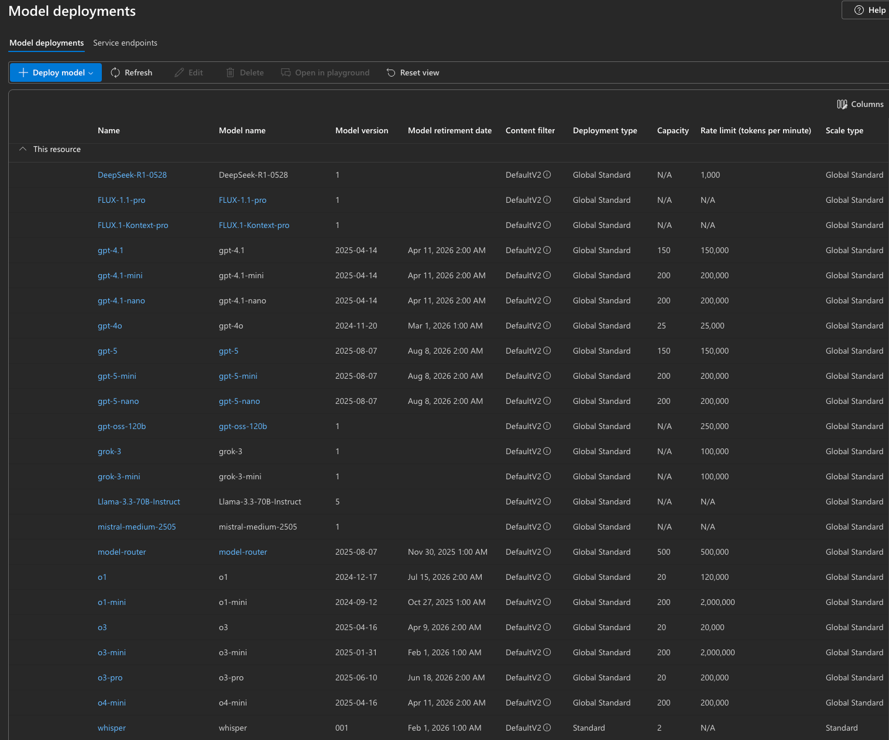
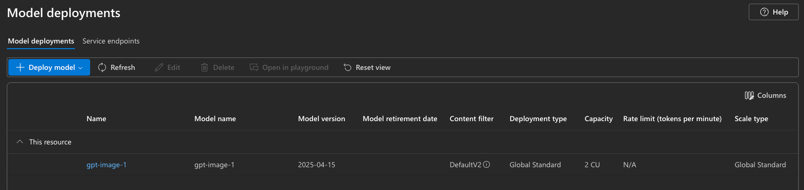

# Deploy Azure AI Foundry models with Terraform

The goal is to deploy all desired models. Not all models are available in every region. The deployment process iterates over all set model definitions and their respective regions, creating a dedicated resource group for each region.  

  




## Login
```bash
az login

# Login with a specific tenant ID
az login --tenant {tenant}

# Set the active subscription
az account set --subscription "{subscription}"
```

## Create Service Principal and Write to File
```bash
# Create a service principal with the Owner role
az ad sp create-for-rbac --role="Owner" --scopes="/subscriptions/{subscription}" --sdk-auth > azure_credentials.json

# Alternatively, create a service principal with the Contributor role
az ad sp create-for-rbac --role="Contributor" --scopes="/subscriptions/{subscription}" --sdk-auth > azure_credentials.json
```

## Initialize Terraform and Global Storage
```bash
terraform init -backend-config="config.azurerm.tfbackend" -upgrade
```

## Get the Cognitive Services Endpoints and Access Keys
```bash
terraform output endpoint
terraform output primary_access_key
```

## Common Terraform Commands
```bash
terraform init
terraform init -backend-config="config.azurerm.tfbackend" -upgrade
terraform validate
terraform plan
terraform apply -auto-approve
terraform destroy
terraform show
terraform state list
terraform state
terraform output <output_definition>
```

## Troubleshooting
``` powershell
# get soft deleted cognitive services accounts
az rest --method get --url "https://management.azure.com/subscriptions/a0fe57e5-df87-4e20-875a-9958172c30b1/providers/Microsoft.CognitiveServices/deletedAccounts?api-version=2021-04-30"

# from the cloud console
Get-AzResource -ResourceId /subscriptions/{subscription}/providers/Microsoft.CognitiveServices/deletedAccounts -ApiVersion 2021-04-30

# delete selective instances
az resource delete --ids ...
```

## Models
[Model availability and regions](https://learn.microsoft.com/en-us/azure/ai-foundry/openai/concepts/models?tabs=global-standard%2Cstandard-chat-completions)